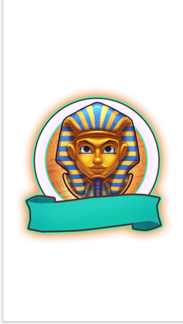
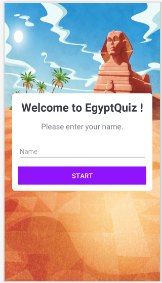
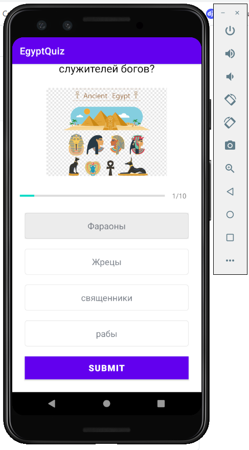
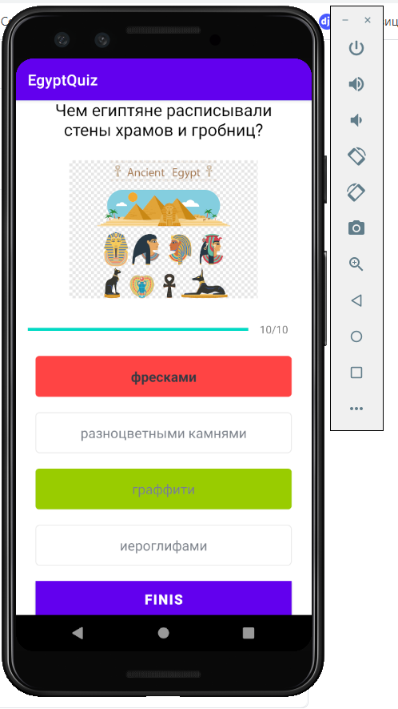
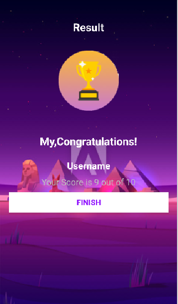

# Egypt Quiz
## Android , Kotlin , Quiz , SplashScreen

### Update 1-st PART  app was written 4 hours !!
Maybe in the Future, I will End all of but at this moment it's app ready for 60%

### Update 2-cond PART spend 3 hours !!
for 19.08.2021 app ready for 90 % 
Total 7 hours

# Splash Screen  ✅

# UserName ✅

# Questions ✅

## Result ✅

