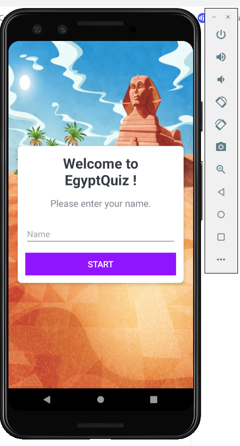
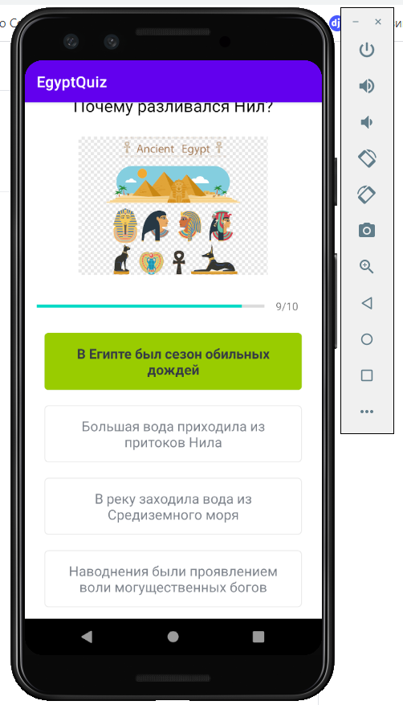

# EgyptQuiz
Android , Kotlin , Quiz , SplashScreen

### All code was written for 5 hours !!
### This is App is my test for position Junior Android Dev
### Maybe in the Future, I will End all of but at this moment its app ready for 65%

# Splash Screen  ✅

# UserName ✅

# Questions 

